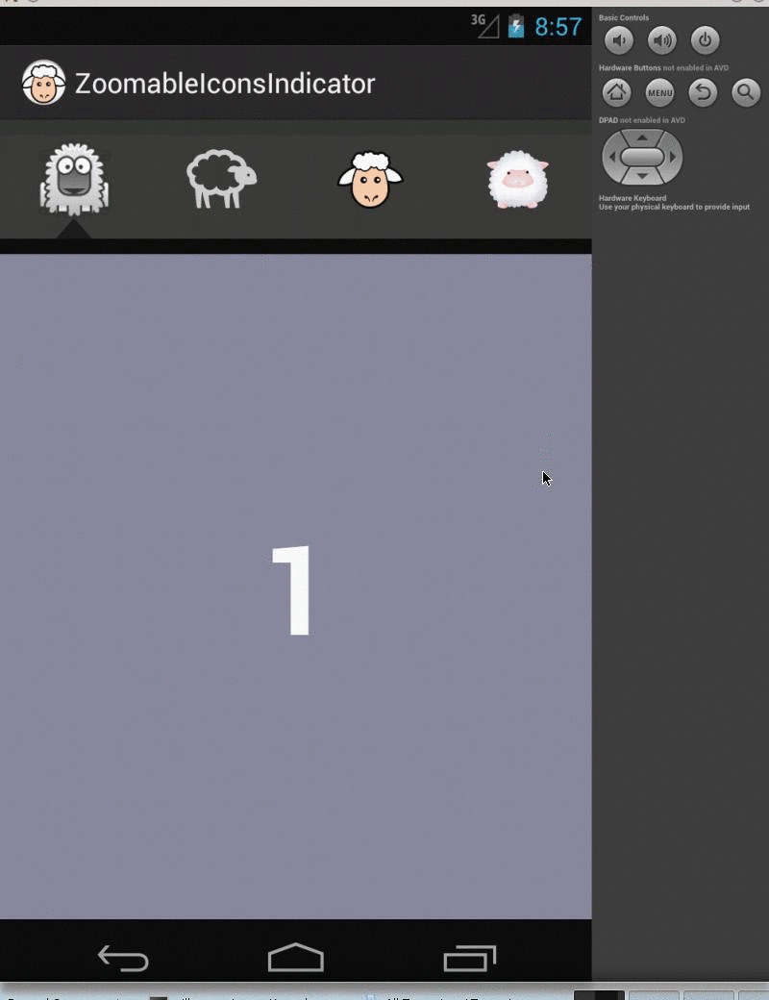

# Android Zoomable Icons Indicator

A paging indicator widget compatible with the `ViewPager` from the [Android Support Library](http://developer.android.com/sdk/compatibility-library.html) and inspired by [ViewPagerIndicator](http://viewpagerindicator.com/).
It displays a fixed row of clickable icons, zoomed when selected.




## Usage

You need to install Android dependencies thanks to [Maven Android SDK Deployer](https://github.com/mosabua/maven-android-sdk-deployer)

```bash
$ cd zoomable-icons-indicator-app
$ mvn clean package android:deploy android:run
```
